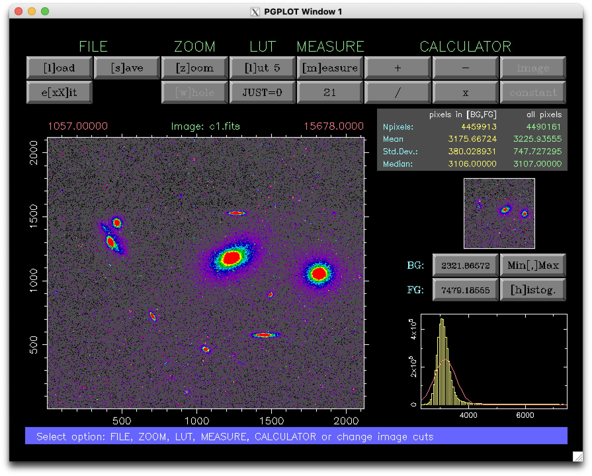

.. ucmima documentation master file, created by
   sphinx-quickstart on Thu Jan  5 19:17:37 2017.
   You can adapt this file completely to your liking, but it should at least
   contain the root `toctree` directive.

Welcome to ucmima's documentation!
==================================

**ucmima** is a simple Fortran 77 program written by N. Cardiel
(cardiel@ucm.es) to display FITS images and perform basic measurements.

This program was created to introduce students of the Astrophysics Master in
the Universidad Complutense de Madrid to perform simple image manipulations in
order to carry out photometric calibrations.

Documentation outline
---------------------

.. toctree::
   :maxdepth: 2

   license_agreement
   installation
   using_the_program

