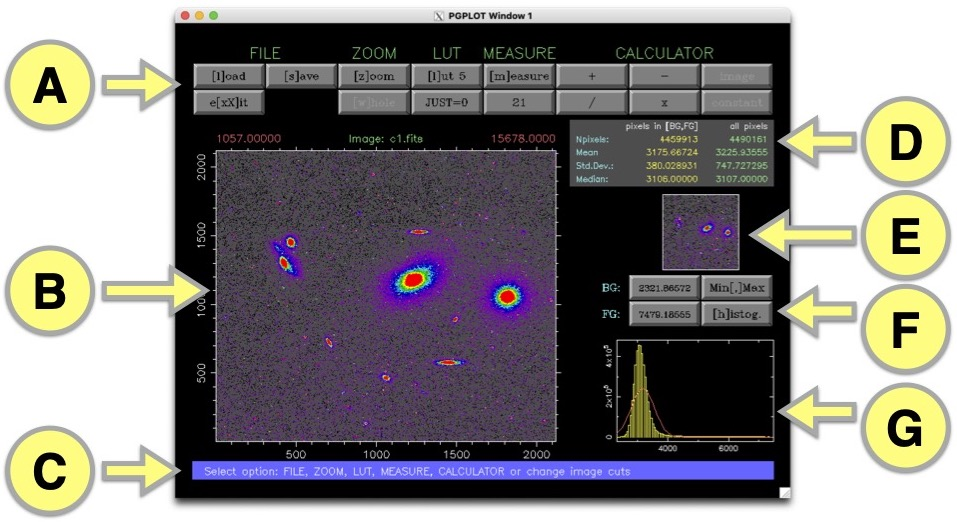

Using the program
=================

After installing the program, you can run **ucmima** by executing:

::

   $ ucmima

Immediately the graphical window opens. 

Description of the user interface
---------------------------------

The next figure shows the
program in a typical execution:

The user interface is divided in different areas (labeled as 
A, B, C,..., G in the previous image).

Several buttons give access to different program actions. This
buttons can be activated by clicking them with the mouse cursor or
by pressing the key that appears between brackets in the button
label.

Area **A** 
..........

Several buttons provide access to different operations:

*FILE* section:

   ``[l]oad``: read FITS image stored in the computer hard disk

   ``[s]ave``: save current FITS image (that may have been
   modified

   ``e[xX]it``: finish the program execution (the uppercase ``X`` does not 
   prompt for confirmation)

*ZOOM* section:

   ``[z]oom``: zoom in the image

   ``[w]ole``: zoom out the image

   ``JUST=0``: if JUST=1, the scales of the x and y axes will be equal;
   otherwise (JUST=0) they will be scaled independently

*LUT* section:

   ``[l]ut #``: modify the palette employed to display the images.
   Five palettes (predefined in PGPLOT) are available: #1 grayscale,
   #2 rainbow, #3 heat (default), #4 weird IRAF, and #5 AIPS.

*MEASURE* section:

   ``[m]easure``: after activating this button, the program
   allows the user to click in any location of the image in order
   to obtain the statistical analysis in a box centered on the
   cursor location. The box has a square shape of side given by
   the number that appears in the button below this one (21
   pixels by default). The resulting statistical summary is
   displayed in the area **D** of the user interface and also in the
   user console.

*CALCULATOR* section: the expected simple binary operations
(:math:`+`, :math:`-`, :math:`\times`, :math:`\div`) can
be applied to the current displayed image. After selecting the
operation, the user must choose if the corresponding
operation will make use of a constant or an image as the second
element.

Area **B**
..........

This is the interface area where the current image is shown. The
axes indicate the displayed pixel region. The image is labeled
(center of the upper part label) with
the name of the FITS file. The minimum and maximum pixel values in
the image are also provided (left and right part of the upper
label). These numbers should not be confused with the background and
foreground values employed to display the image (which appears in
the buttons in the area **F**).

Area **C**
..........

Relevant messages for the user of the program appear in this area.

Area **D**
..........

Image statistical results. The statistical computation normally
refers to the image displayed in area **B**, except when the user is
manually selecting image regions (after clicking the ``[m]easure``
button in area **A**). In both cases, two columns with statistical
data are displayed. The yellow column corresponds to the statistical
summary computed when using exclusively the pixels with values in
the range from background to foreground, whereas the green column
provides the same summary using all the pixels (i.e., without any
clipping based on the pixel value).

The pixel summary provides the number of pixels used to compute the
statistics ``Npixels``, the mean ``Mean``, the standard deviation
``Std.Dev.``, and median ``Median``.

Area **E**
..........

Auxiliary image display. When the user has zoomed the main image in
area **B**, in this auxiliary display the program shows the whole
image and the limits of the zoomed region as a green rectangle. On
the other hand, while the user is taking measurements after clicking
the ``[m]easure`` button in area **A**, this auxiliary display shows
exclusively the measured region. In this case the pixels outside the
[background, foreground] interval are marked with crosses.

Area **F**
..........

Background and foreground handlers. The current values are displayed
in the buttons on the left side of this area. Their values can be
easily modified clicking the corresponding button. In addition, the
user can establish as background and foreground the minimum and
maximum values in the displayed image by clicling the ``Min[,]Max``
button. Finally, the background and foreground values can be chosen
over the image histogram showed in area **G** after clicking  as
background and foreground the minimum and maximum values in the
displayed image by clicling the ``Min[,]Max`` button. Finally, the
background and foreground values can be chosen over the image
histogram showed in area **G** after clicking  as background and
foreground the minimum and maximum values in the displayed image by
clicling the ``Min[,]Max`` button. Finally, the background and
foreground values can be chosen over the image histogram showed in
area **G** by clicking first the button ``[h]istog.``.

Area **G**
..........

Image histogram. The minimum and maximum values in the horizontal
axis correspond to the current background and foreground values.

Typical program usage
---------------------

After starting the program by executing

::

   $ ucmima

the user must load a FITS image by pressing the button ``[l]oad``.
Immediately, the image will be displayed in area **B**. The
automatically computed background and foreground values can be
easily modified using the buttons that appear in area **F**. The
image histogram appears in area **G**.

The displayed image region can be easily modified by zooming in and
out using the corresponding buttons located in area **A**.

When the user is ready to start taking measurements, the
button ``[m]easure`` in area **A** must be selected. From this
moment, the user must click of the image displayed in area **B** in
order to indicate the region where the statistical measurements are
going to be obtained. The results appear in area **D** as well as in
the console. To exit the measurement mode the user must click the
cancel button of the mouse (or press the uppercase ``X`` key).

Simple arithmetical manipulations can be carried out using the
CALCULATOR buttons that appear in area **A**. The image resulting
from this mathematical manipulation will become the current image
displayed in area **B**. This modified image can be saved into an
external FITS file by selecting the ``[s]ave`` button in area **A**.

The user can exit the program by clicking ``e[x]it``.
